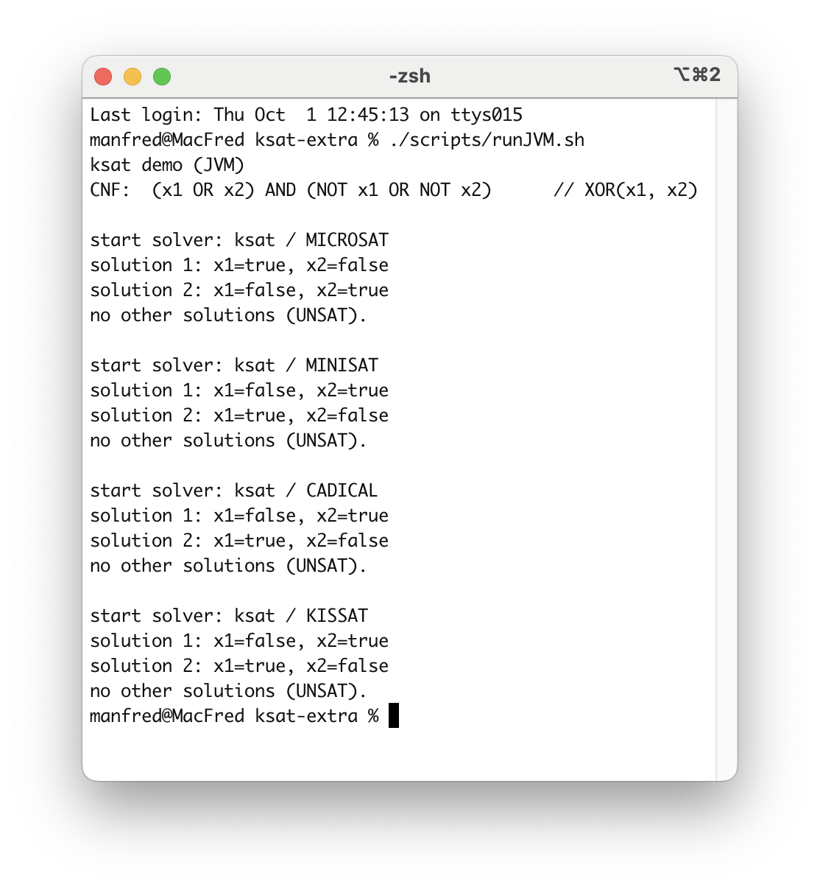
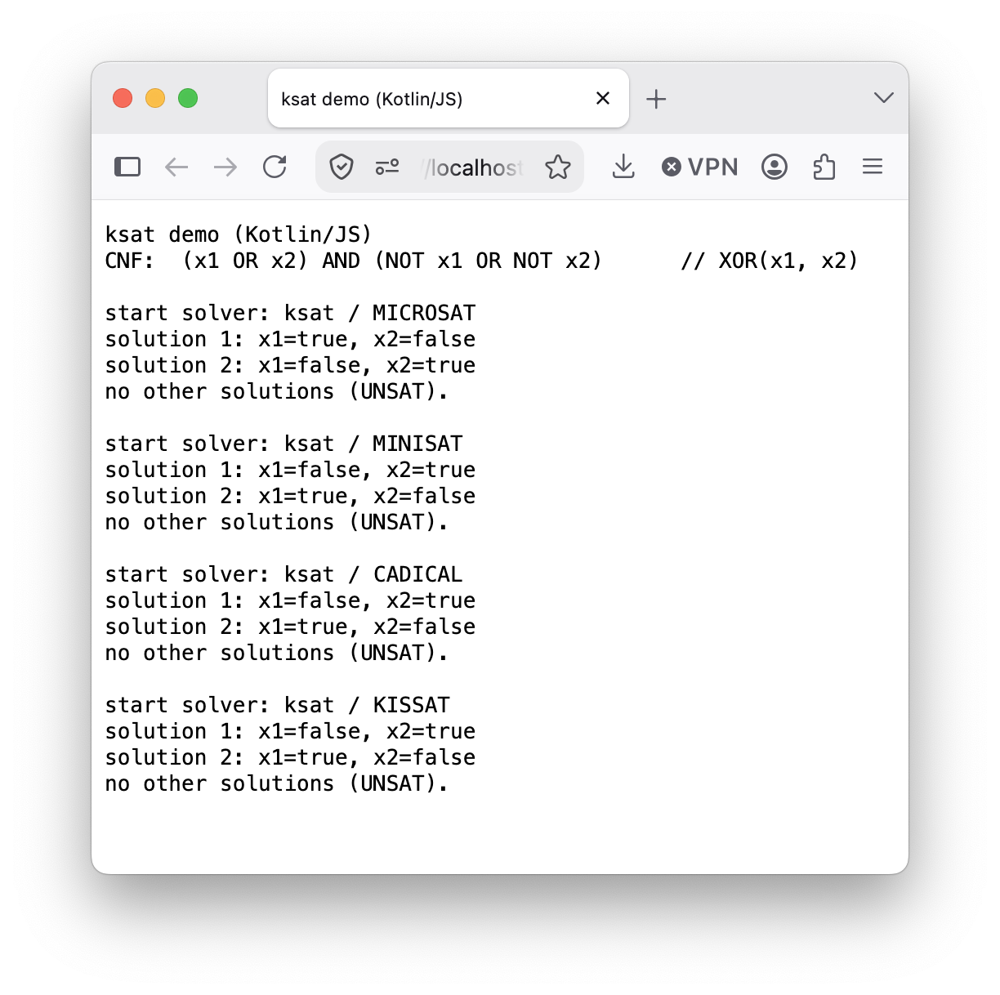
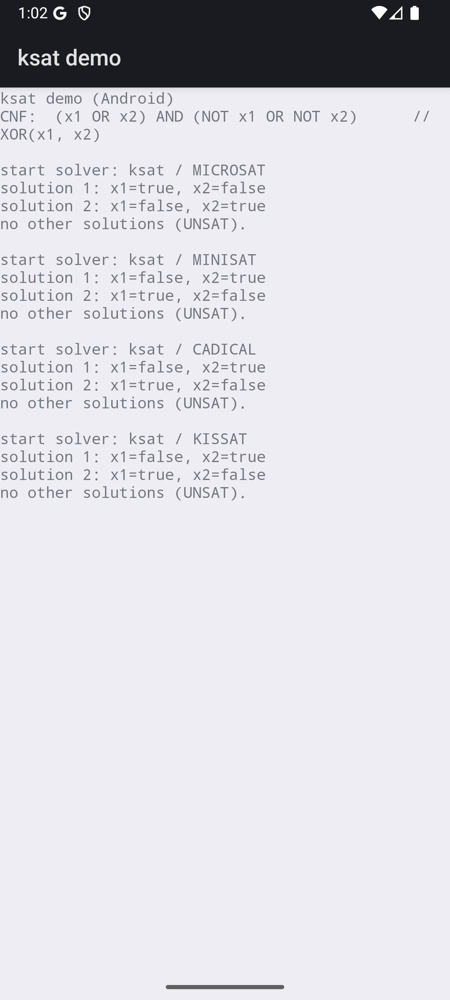
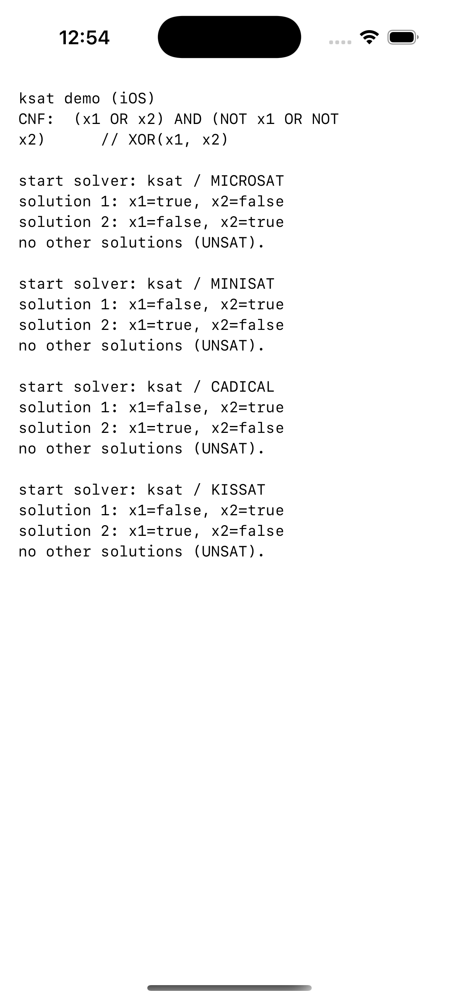

# ksat-extra

Extra material for [sat-solvers-kotlin](https://github.com/manfredscheucher/sat-solvers-kotlin):
a multiplatform demo, runtime benchmarks, docs, and the shadowing harness. Its own repo so the
main one stays small; an optional submodule there, NOT pulled by default. Get it with:

```bash
git clone --recursive https://github.com/manfredscheucher/sat-solvers-kotlin.git
cd sat-solvers-kotlin
git submodule update --init --checkout ksat-extra    # --recursive alone skips it
```

## Demo

`demo/` enumerates all models of XOR(x1,x2) with every solver, then UNSAT — the SAME Kotlin
running on JVM, in the browser, on Android and on iOS. One-line run scripts per target in
`scripts/`; see [`demo/README.md`](demo/README.md).

<table>
  <tr>
    <td align="center" width="50%">
      <b>JVM</b>
      <p></p>
    </td>
    <td align="center" width="50%">
      <b>JS/Browser</b>
      <p></p>
    </td>
  </tr>
  <tr>
    <td align="center" width="50%">
      <b>Android</b>
      <p></p>
    </td>
    <td align="center" width="50%">
      <b>iOS</b>
      <p></p>
    </td>
  </tr>
</table>

## Benchmarks

`doc/benchmarks.*` — measured runtime of each Kotlin port vs the original C solver (and
Kotlin/JVM vs Kotlin/Native), on pigeonhole instances.

## Shadowing harness

`shadow/` holds the C references and the tooling to verify each Kotlin port behaves identically
to its C original (not just same SAT/UNSAT, but the same step-by-step trace). What that means
and how to run it: [`shadow/README.md`](shadow/README.md); the methodology and per-solver status:
[`doc/`](doc/README.md).

## License

MIT. The C/C++ references are derivative of their MIT-licensed originals (microSAT © Marijn
Heule; MiniSat © Niklas Eén & Niklas Sörensson; CaDiCaL and kissat © Armin Biere and
contributors); their license headers are preserved in the source files.
